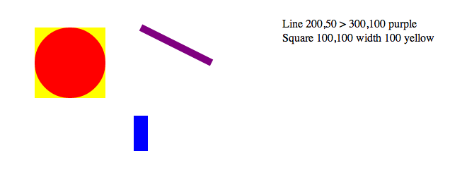

#Osprey Data Visualization Exercises

Howdy! I split the shapes.js file up into 2 files.
line.text.js && circle.rectangle.square.js
These files have adequate commenting for class files.

All of my js files are in the [Solution] directory

part1 = shapes.html
---It looks like the .png to me.

part2 = part2.html
--- I drew some dots as well as lines,

---The commenting might be slightly verbose but I'm trying to show my thought process to make it easier for you to evaluate me.

---Thats some rising co2 levels, makes me wonder why google builds 
its fiber infrastructure in cities well above sea level and inland. ;-)

part3 = part3.js
--- I grabbed the playfair data, used the classes we wrote for this excercise.

--- this was more about having meaningful inferences "jump out" than it was about me spooling up d3 and making lots of responsive animated transitions.

---The width of the red bar is relative to the diameter of the city

---The height is relative to population

---Yellow or Green bars represent the smallest city diameter as a "unit"; an Edinburgh. (they alternate for visibility)

---Orange is the diameter beyond the "smallest city unit", lets you see that Venice is almost 2 Edinburghs.

---Yellow Green and Orange lets me look quickly at a city and see things like: London is 4+ Edinburgh's in diameter.

---So comparing Yellow Green and Orange to Red gives us a visual clue to population density. Longon is 4+ Edinburghs in Diameter but 18.4 times the population

---Hovering on a red bar shows you the city "factoid".

Me: My name is Deven Edward Pitcher, I like solving problems, I like data modeling, I was a Cognitive Scientist in undergrad, I think about models, representations, relationships, inferences, implications, scale, context, and semantics.

Visit me at OhDeven.com

-Dev

##Part 1: Shapes Object Library

Write a set of objects in pure Javascript (i.e. not coffeescript) to
draw basic geometric shapes.

The shapes should be implemented using the basic shapes defined in the [SVG
Specification](http://www.w3.org/TR/SVG11/shapes.html).

The required shape classes and their associated attributes are:

   * `Line`: x1, y1, x2, y2, stroke, strokeWidth
   * `Circle`: cx, cy, center, width, stroke, strokeWidth, fill
   * `Rectangle`: cx, cy, center, width, height, stroke, strokeWidth, fill
   * `Square`: cx, cy, center, width, height, stroke, strokeWidth, fill
   * `Text`: x, y, text

The definitions of the attributes are:

   * `stroke`: Stroke color value
   * `strokeWidth`: Stroke width in pixels
   * `fill`: Fill color value
   * `cx` / `cy`: The coordinates of the center of the shape in pixels
   * `center(x, y)`: Convenience function to set both cx and cy at once
   * `x1`,`y1`,`x2`,`y2`: The start / end points of a line in pixels
   * `x`,`y`: The location of the text element in pixels
   * `width`: The width of the shape (i.e. diameter of a circle) in pixels
   * `height`: The height of the shape in pixels. For a `Square` this should do the same thing as `width`

All (x, y) coordinates are offsets from the top left corner of the container svg element. All color values can be [any value supported by SVG and CSS](http://www.w3.org/TR/2008/REC-CSS2-20080411/syndata.html#value-def-color).

Each attribute should be implemented using [method chaining](http://en.wikipedia.org/wiki/Method_chaining) accessor functions.

For example to set and then the stroke and stroke width of a new line object:

    var l = new Line()
        .stroke('blue')
        .strokeWidth(2);

    l.stroke(); // return 'blue'
    l.strokeWidth(); // return 2

Each shape should also support a `draw(parent)` function that adds the element to the `parent` svg element.

The following example (included [here](./shapes.html)) shows the expected class interface.

    <html>
       <head>
          
       </head>
       <body>
          <svg id="container" width="800" height="600" ></svg>
          
       </body>
    </html>

The result of your code should be functionally the same as the following HTML (though tag attributes may be in a different order, etc).

    <html>
       <body>
          <svg id="container" width="800" height="600">
             <line stroke="purple" stroke-width="10" x1="200" x2="300" y1="50" y2="100"></line>
             <rect fill="yellow" x="50" y="50" width="100" height="100"></rect>
             <circle fill="red" cx="100" cy="100" r="50"></circle>
             <rect fill="blue" x="190" y="175" width="20" height="50"></rect>
             <text x="400" y="50">Line 200,50 &gt; 300,100 purple</text>
             <text x="400" y="70">Square 100,100 width 100 yellow</text>
          </svg>
       </body>
    </html>

When rendered, it should look like this:

## Part 2: Basic Data Visualization

In the [data](./data) directory there are a couple of sample data sets extracted from [here](http://www.stat.purdue.edu/~wsc/visualizing.datatables/) and [here](https://github.com/deremer/Cities/). 

The data is available in a couple of formats -- the original plain text, .json, and .js formats. The .js files are included to simplify working with the data in environments that don't support AJAX.

Using the `Line` and `Text` objects that you defined in Part 1, draw a timeseries line chart of the co2 data [here](./data/co2.js). Feel free to use generic javascript helper libraries like [underscore.js](http://underscorejs.org/) or [jquery](http://jquery.com/) but don't use another data visualization framework.

## Part 3: Creative Data Visualization

Using either your own shapes or any other javascript data visualization or charting framework, implement whatever interesting data visualization you choose on these (or other) data sets. 

This is (obviously) an open-ended problem. The key points to consider are how to effectively convey some analysis of the data and / or let the user draw interesting conclusions from the data.

